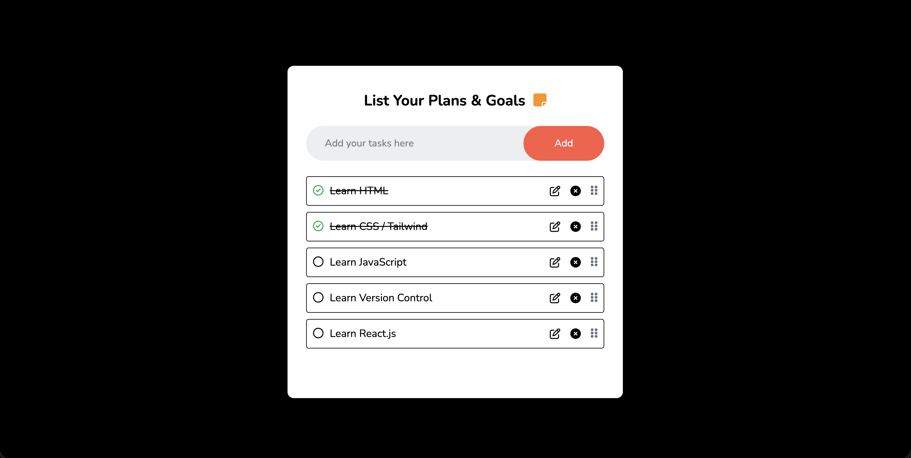
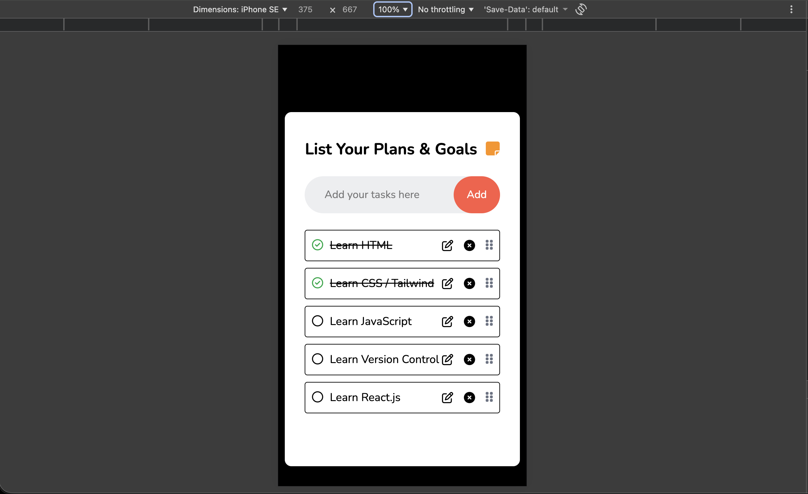

# Advanced Task Manager

A feature-rich task management application built with React, implementing full CRUD operations, drag-and-drop reordering using dnd-kit, and persistent state management through a custom localStorage hook.

---

## 🛠 Tech Stack

- React
- JavaScript (ES6+)
- @dnd-kit (Drag and Drop)
- Custom React Hooks
- Local Storage

---

## ✨ Features

- Create, update, and delete tasks (Full CRUD)
- Drag-and-drop task reordering using dnd-kit
- Persistent task storage using localStorage
- Custom hook for managing localStorage logic
- Real-time UI updates
- Conditional rendering for empty states
- Responsive and clean UI

---

## 🧠 Key Implementation Details

- Implemented full CRUD operations using React state management
- Integrated `@dnd-kit` for accessible and performant drag-and-drop interactions
- Created a reusable custom hook to abstract localStorage logic
- Managed task reordering state updates efficiently
- Applied conditional rendering to handle empty task states
- Structured components for scalability and maintainability

---

## 📸 Screenshots

Task manager dashboard in desktop view

Task manager dashboard in mobile view

---

## 📦 Installation

1. Clone the repository

git clone https://github.com/sumanth-git-hub/web-development/tree/main/React.js/Projects/08-drag-and-drop-crud.git

2. Navigate into the project directory

cd 08-drag-and-drop-crud

3. Install dependencies

npm install

4. Start the development server

npm run dev

---

## 📌 What I Learned

- Managing complex state transitions in React
- Implementing drag-and-drop interactions using dnd-kit
- Abstracting reusable logic into custom hooks
- Persisting and synchronizing state with localStorage
- Designing interactive and user-friendly task management interfaces