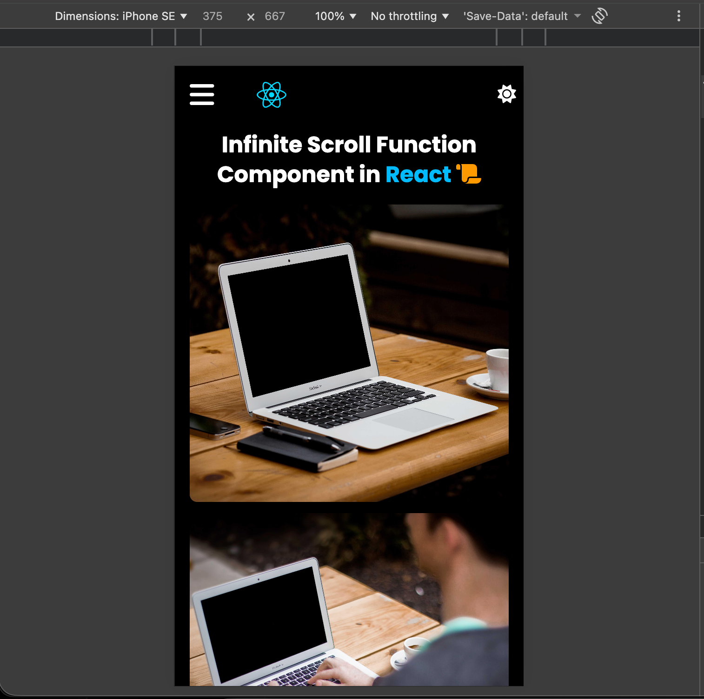

# Infinite Image Gallery

A responsive image gallery application built with React that dynamically loads images using infinite scrolling. 
The project leverages the IntersectionObserver API for efficient scroll detection and includes proper loading and error state handling.

---

## 🛠 Tech Stack

- React
- JavaScript (ES6+)
- IntersectionObserver API
- REST API (for image data)
- CSS / Tailwind

---

## ✨ Features

- Fetches image data from a public API
- Infinite scrolling using IntersectionObserver
- Dynamic content rendering
- Loading state indicator while fetching data
- Error state handling for failed API requests
- Responsive grid layout for different screen sizes

---

## 🧠 Key Implementation Details

- Implemented infinite scroll using the native IntersectionObserver API
- Managed asynchronous API requests using React hooks
- Applied conditional rendering for loading and error states
- Optimized re-rendering to ensure smooth user experience
- Structured reusable components for scalability

---

## 📸 Screenshots

Responsive Mobile View of Infinite Scroll 

---

## 📦 Installation

1. Clone the repository

git clone https://github.com/sumanth-git-hub/web-development/tree/main/React.js/Projects/20-infinite-scroll-in-react.git

2. Navigate into the project directory

cd 20-infinite-scroll-in-react

3. Install dependencies

npm install

4. Start the development server

npm run dev

---

## 📌 What I Learned

- Implementing infinite scrolling using IntersectionObserver
- Managing paginated API requests efficiently
- Handling loading and error states in asynchronous applications
- Designing responsive grid-based layouts
- Improving performance by avoiding unnecessary scroll event listeners